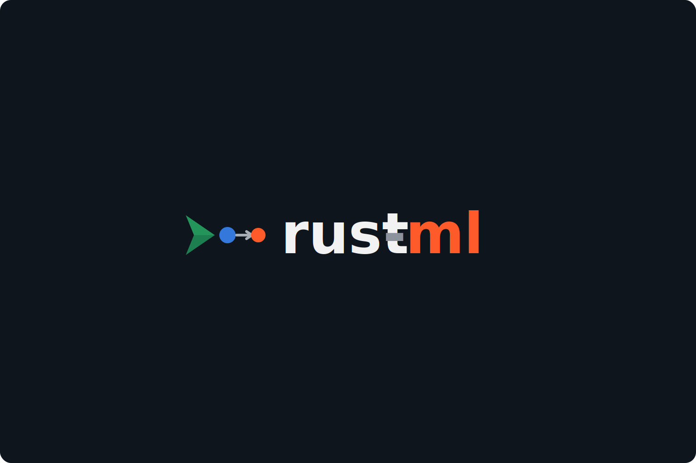

<p align="center">
  
</p>

# Rust ML Systems from First Principles

A beginner course for learning machine learning as a translation problem:

`plain English <-> algebra <-> Rust newtypes <-> composable maps`

The goal is not to memorize symbols. The goal is to learn how to read formulas as programs, how to read Rust code as precise mathematical structure, and how to use category-theory intuition to see models as composed maps between meaningful types.

For the canonical curriculum layout, see [lessons/Course Structure](lessons/COURSE-STRUCTURE.md).
For the recommended learner route, see [Learning Path](LEARNING-PATH.md).
For the object/map progression across lessons, code, and assignments, see [Concept Atlas](lessons/CONCEPT-ATLAS.md).

## Who This Is For

- Beginners with little or no machine learning background
- Rust learners who want a concrete reason to use vectors, structs, loops, and functions
- Self-paced learners who want short lessons and small practice steps

## Start Here

1. Read [Learning Path](LEARNING-PATH.md).
2. Read [The Learning Lens](lessons/00-learning-lens.md).
3. Keep [Concept Atlas](lessons/CONCEPT-ATLAS.md) open as the object/map guide.
4. Read [01 Foundations](lessons/01-foundations/README.md).
5. Continue with [02 Vectors](lessons/02-vectors/README.md).
6. Continue with [03 Neuron](lessons/03-neuron/README.md).
7. Continue with [04 Learning](lessons/04-learning/README.md).
8. Continue with [05 MLP](lessons/05-mlp/README.md).
9. Continue with [06 Attention](lessons/06-attention/README.md).
10. Continue with [07 Transformer](lessons/07-transformer/README.md).

The repo uses sequential folder numbers even though the curriculum starts at Module 0:

- Course Module 0 -> Repo folder `lessons/01-foundations`
- Course Module 1 -> Repo folder `lessons/02-vectors`
- Course Module 2 -> Repo folder `lessons/03-neuron`
- Course Module 3 -> Repo folder `lessons/04-learning`
- Course Module 4 -> Repo folder `lessons/05-mlp`
- Course Module 5 -> Repo folder `lessons/06-attention`
- Course Module 6 -> Repo folder `lessons/07-transformer`

The orientation file [lessons/00-learning-lens.md](lessons/00-learning-lens.md) comes before Module 0 and explains the shared newtype/category-theory lens.

## What Exists Now

### Current coherent path

- [Lessons index](lessons/README.md)
- [Learning Path](LEARNING-PATH.md)
- [The Learning Lens](lessons/00-learning-lens.md)
- [Concept Atlas](lessons/CONCEPT-ATLAS.md)
- [01 Foundations](lessons/01-foundations/README.md)
- [02 Vectors](lessons/02-vectors/README.md)
- [03 Neuron](lessons/03-neuron/README.md)
- [04 Learning](lessons/04-learning/README.md)
- [05 MLP](lessons/05-mlp/README.md)
- [06 Attention](lessons/06-attention/README.md)

### Neuron track now included

- [Rust Essentials for a Tiny Neuron](lessons/03-neuron/01-rust-essentials-for-a-tiny-neuron.md)
- [A Neuron as a Chain of Functions](lessons/03-neuron/02-neuron-as-a-chain-of-functions.md)
- [Neuron exercises](lessons/03-neuron/exercises.md)
- [Neuron solutions](lessons/03-neuron/solutions.md)

### MLP bridge now included

- [Hidden Layers as Representations](lessons/05-mlp/01-hidden-layers-as-representations.md)
- [Shape Flow Through an MLP](lessons/05-mlp/02-shape-flow-through-an-mlp.md)
- [MLP exercises](lessons/05-mlp/exercises.md)
- [MLP solutions](lessons/05-mlp/solutions.md)

### Attention bridge now included

- [Tokens as Vectors in a Sequence](lessons/06-attention/01-tokens-as-vectors-in-a-sequence.md)
- [Query, Key, and Value Roles](lessons/06-attention/02-query-key-value-roles.md)
- [Scores, Weights, and Value Mixing](lessons/06-attention/03-scores-weights-and-value-mixing.md)
- [Attention exercises](lessons/06-attention/exercises.md)
- [Attention solutions](lessons/06-attention/solutions.md)

### Transformer capstone

- [07 Transformer](lessons/07-transformer/README.md)
- [What Problem the Transformer Solves](lessons/07-transformer/01-tiny-transformer-from-first-principles.md)
- [Typed Rust Transformer with Expressive Errors](lessons/07-transformer/02-typed-rust-transformer-with-linear-attention.md)
- [Transformer Encoder in Small Chunks](lessons/07-transformer/03-transformer-encoder-in-small-chunks.md)
- [Transformer exercises](lessons/07-transformer/exercises.md)
- [Transformer solutions](lessons/07-transformer/solutions.md)

### Executable companion code

- [Code index](code/README.md)
- [category lens crate](code/category_lens/README.md)
- [neuron crate](code/neuron/README.md)
- [mlp crate](code/mlp/README.md)
- [attention crate](code/attention/README.md)
- [transformer crate](code/transformer/README.md)
- [language-modeling basics crate](code/lm_basics/README.md)
- [systems crate](code/systems/README.md)
- [kernels crate](code/kernels/README.md)
- [scaling crate](code/scaling/README.md)
- [data crate](code/data/README.md)
- [evaluation crate](code/evaluation/README.md)
- [inference crate](code/inference/README.md)
- [parallelism crate](code/parallelism/README.md)
- [alignment crate](code/alignment/README.md)

### CS336 Rust equivalent track

- [CS336 Rust Equivalent](CS336-RUST-EQUIVALENT.md)
- [CS336 Rust assignments](assignments/cs336-rust/README.md)
- [CS336 source map](references/courses/cs336-language-modeling-from-scratch.md)

### Source material and roadmap

- [Reference material](references/README.md)
- [Public content boundary](PUBLIC_CONTENT.md)
- [Book note](book/README.md)

## Repo Map

```text
rust-ml/
├── assignments/ # original Rust assignment tracks
├── lessons/    # canonical course content
├── references/ # transcripts and papers used as source material
├── code/       # runnable companion crates
├── book/       # non-authoritative note; this is repo-first for now
└── README.md
```

## Working Rules For This Repo

- `lessons/` is the source of truth for written teaching content.
- `code/` follows the lesson progression and now includes a real tested `transformer` crate.
- `code/systems` is the active R2 systems-measurement and public-report bridge for the CS336 Rust equivalent track.
- `code/kernels` is the active kernels-and-tiling bridge for the CS336 Rust equivalent track.
- `code/scaling` is the active R3 scaling-evidence and public-report bridge for the CS336 Rust equivalent track.
- `code/data` is the active R4 data-preparation bridge for the CS336 Rust equivalent track.
- `code/evaluation` is the active evaluation bridge for the CS336 Rust equivalent track.
- `code/inference` is the active inference bridge for the CS336 Rust equivalent track.
- `code/parallelism` is the active parallelism and public-report bridge for the CS336 Rust equivalent track.
- `code/alignment` is the active R5 post-training signal and public-release bridge for the CS336 Rust equivalent track.
- `book/` is not the public surface right now; this is a repo-first learning resource.
- `lessons/COURSE-STRUCTURE.md` is the canonical structure guide for module and lesson contracts.
- `lessons/CONCEPT-ATLAS.md` is the learner-facing map from ML concepts to Rust newtypes, composable maps, and runnable proofs.
- Public learner-facing content must follow [Public Content Boundary](PUBLIC_CONTENT.md).

## Learning Strategy

The course keeps the same translation goal everywhere:

`plain English <-> algebra <-> Rust newtypes <-> composable maps`

The current repo intentionally has two learning depths:

- a coherent path through Modules 0, 1, 2, 3, 4, and 5
- a Transformer capstone in Module 6

Module 6 applies the translation rule in two complementary ways:

- narrative lessons that explain the architecture and the implementation choices
- a chunked encoder lesson where every concept is written as `English -> Algebra -> Rust`

That repetition is intentional. Repetition is how the translation dictionary becomes automatic.

## Suggested Study Flow

1. Read the module README.
2. Work through the lesson files in order.
3. Do the module exercises without copying from the solutions first.
4. Use the solution files to check reasoning, naming, and Rust syntax.
5. Move to the next module only after you can explain each formula out loud in English.

Current recommended sequence:

1. [Learning Path](LEARNING-PATH.md)
2. [The Learning Lens](lessons/00-learning-lens.md)
3. [Concept Atlas](lessons/CONCEPT-ATLAS.md)
4. [01 Foundations](lessons/01-foundations/README.md)
5. [02 Vectors](lessons/02-vectors/README.md)
6. [03 Neuron](lessons/03-neuron/README.md)
7. [04 Learning](lessons/04-learning/README.md)
8. [05 MLP](lessons/05-mlp/README.md)
9. [06 Attention](lessons/06-attention/README.md)
10. [07 Transformer](lessons/07-transformer/README.md)

## Running The Code

Run every active teaching crate:

```bash
cargo test --manifest-path code/Cargo.toml --workspace --all-targets
```

Run the beginner neuron ladder:

```bash
cargo run --manifest-path code/Cargo.toml -p rust_ml_neuron --example 01_weighted_sum
cargo run --manifest-path code/Cargo.toml -p rust_ml_neuron --example 02_forward_pass
cargo run --manifest-path code/Cargo.toml -p rust_ml_neuron --example 03_one_step_training
cargo run --manifest-path code/Cargo.toml -p rust_ml_neuron --example 04_and_gate_epoch
```

The neuron crate covers:

- semantic scalar types such as `InputValue`, `Weight`, `Bias`, `Target`, and `LearningRate`
- explicit `TryFrom` adapters for raw learner numbers
- readable typed arithmetic through `std::ops` implementations
- feature and weight vectors with shape checks
- one forward pass from weighted sum to sigmoid prediction
- one training step with visible gradients and loss before/after
- a tiny AND-gate training loop for intuition

Run the MLP bridge ladder:

```bash
cargo run --manifest-path code/Cargo.toml -p rust_ml_mlp --example 01_hidden_features
cargo run --manifest-path code/Cargo.toml -p rust_ml_mlp --example 02_shape_flow
cargo run --manifest-path code/Cargo.toml -p rust_ml_mlp --example 03_forward_trace
cargo run --manifest-path code/Cargo.toml -p rust_ml_mlp --example 04_xor_table
```

The MLP crate covers:

- semantic layer roles such as `InputVector`, `HiddenActivation`, `OutputLogit`, and `Prediction`
- explicit `TryFrom` adapters for raw learner numbers
- typed arithmetic with `std::ops` for weighted products, sums, and bias addition
- finite-value and probability-range invariants
- dense layer shape checks with expressive errors
- a deterministic XOR-shaped forward pass
- learner-visible hidden activations and logits

Run the attention bridge ladder:

```bash
cargo run --manifest-path code/Cargo.toml -p rust_ml_attention --example 01_score_one_pair
cargo run --manifest-path code/Cargo.toml -p rust_ml_attention --example 02_softmax_focus
cargo run --manifest-path code/Cargo.toml -p rust_ml_attention --example 03_weighted_sum
cargo run --manifest-path code/Cargo.toml -p rust_ml_attention --example 04_attention_trace
```

The attention crate covers:

- semantic token, query, key, value, score, weight, and output roles
- explicit `TryFrom` adapters for raw learner literals
- typed arithmetic with `std::ops` for projection products, score contributions, and weighted value mixing
- stable softmax over attention scores
- weighted sums over value vectors
- learner-visible attention traces for one query token
- shape and range errors for invalid sequences, projections, and weights

Run the first CS336 Rust language-modeling artifact:

```bash
cargo run --manifest-path code/Cargo.toml -p rust_ml_lm_basics --example 01_tokenize_and_encode
cargo run --manifest-path code/Cargo.toml -p rust_ml_lm_basics --example 02_next_token_batch
cargo run --manifest-path code/Cargo.toml -p rust_ml_lm_basics --example 03_uniform_loss
cargo run --manifest-path code/Cargo.toml -p rust_ml_lm_basics --example 04_training_step
cargo run --manifest-path code/Cargo.toml -p rust_ml_lm_basics --example 05_public_training_example
```

The language-modeling basics crate covers:

- `RawText`, `Token`, `TokenId`, `VocabularySize`, `ContextLength`, `Position`, `Logit`, `Loss`, `LearningRate`, and `PublicLanguageModelingExample`
- explicit `TryFrom` adapters for raw learner literals
- checked vocabulary encoding
- next-token batch construction
- uniform cross-entropy loss
- one tiny gradient step over a bigram logit table
- a typed public-example boundary that rejects restricted or private text before tokenization

Run the first CS336 Rust systems artifact:

```bash
cargo run --manifest-path code/Cargo.toml -p rust_ml_systems --example 01_memory_accounting
cargo run --manifest-path code/Cargo.toml -p rust_ml_systems --example 02_attention_flops
cargo run --manifest-path code/Cargo.toml -p rust_ml_systems --example 03_median_timing
cargo run --manifest-path code/Cargo.toml -p rust_ml_systems --example 04_arithmetic_intensity
cargo run --manifest-path code/Cargo.toml -p rust_ml_systems --example 05_memory_hierarchy
cargo run --manifest-path code/Cargo.toml -p rust_ml_systems --example 06_public_report
```

The systems crate covers:

- `BatchSize`, `SequenceLength`, `ModelWidth`, `Bytes`, `BytesPerSecond`, `MemoryLevel`, `Flops`, `ElapsedNanos`, `ArithmeticIntensity`, and `PublicSystemsReport`
- explicit `TryFrom` adapters for raw learner literals
- activation memory estimates
- matrix-vector FLOP and byte estimates
- dense self-attention score/value FLOP estimates
- median timing over repeated stage measurements
- arithmetic intensity as the bridge between math and memory traffic
- accelerator memory hierarchy as typed byte movement and bandwidth
- a typed public-report boundary that rejects restricted or private measurements

Run the first CS336 Rust kernels artifact:

```bash
cargo run --manifest-path code/Cargo.toml -p rust_ml_kernels --example 01_elementwise_gelu
cargo run --manifest-path code/Cargo.toml -p rust_ml_kernels --example 02_row_sum_reduction
cargo run --manifest-path code/Cargo.toml -p rust_ml_kernels --example 03_tiled_matvec
cargo run --manifest-path code/Cargo.toml -p rust_ml_kernels --example 04_kernel_estimate
```

The kernels crate covers:

- `MatrixShape`, `TileShape`, `TilePlan`, `KernelScalar`, `Accumulator`, `Bytes`, and `FlopCount`
- explicit `TryFrom` adapters for raw learner literals
- typed `std::ops` arithmetic for element counts, byte counts, FLOP counts, scalar products, and accumulation
- elementwise GeLU-style traces
- row reductions through a typed accumulator
- tiled matrix-vector traces with visible tile windows
- typed byte and FLOP estimates that keep resource units separate

Run the first CS336 Rust scaling artifact:

```bash
cargo run --manifest-path code/Cargo.toml -p rust_ml_scaling --example 01_record_runs
cargo run --manifest-path code/Cargo.toml -p rust_ml_scaling --example 02_fit_power_law
cargo run --manifest-path code/Cargo.toml -p rust_ml_scaling --example 03_forecast_loss
cargo run --manifest-path code/Cargo.toml -p rust_ml_scaling --example 04_report_limitations
cargo run --manifest-path code/Cargo.toml -p rust_ml_scaling --example 05_tradeoff_decision
cargo run --manifest-path code/Cargo.toml -p rust_ml_scaling --example 06_public_report
```

The scaling crate covers:

- `RunId`, `ParameterCount`, `TokenCount`, `TrainingStep`, `ComputeBudgetFlops`, `ValidationLoss`, `ScalingExponent`, `ScalingTradeoff`, and `PublicScalingReport`
- explicit `TryFrom` adapters for raw learner literals
- typed experiment configs and run records
- checked parameter-token compute estimates
- log-log power-law fitting over validation loss
- forecast errors and limitation notes for tiny evidence
- typed baseline-versus-candidate tradeoff decisions
- a typed public-report boundary that rejects restricted or private metric records

Run the first CS336 Rust data artifact:

```bash
cargo run --manifest-path code/Cargo.toml -p rust_ml_data --example 01_normalize_documents
cargo run --manifest-path code/Cargo.toml -p rust_ml_data --example 02_filter_and_dedup
cargo run --manifest-path code/Cargo.toml -p rust_ml_data --example 03_build_shard
cargo run --manifest-path code/Cargo.toml -p rust_ml_data --example 04_source_mixture
cargo run --manifest-path code/Cargo.toml -p rust_ml_data --example 05_public_manifest
```

The data crate covers:

- `DocumentId`, `SourceName`, `RawText`, `NormalizedText`, `DedupKey`, `FilterReason`, `MixtureWeight`, `CorpusShard`, `DatasetCard`, and `PublicCorpusManifest`
- explicit `TryFrom` adapters for raw learner literals
- deterministic normalization
- durable filter decisions with rejection reasons
- duplicate detection by normalized-text key
- source mixtures with non-negative weights and a positive total
- a typed public manifest boundary that rejects restricted or private source cards
- readable checked newtype addition for manifest document and token totals

Run the first CS336 Rust evaluation artifact:

```bash
cargo run --manifest-path code/Cargo.toml -p rust_ml_evaluation --example 01_score_prediction
cargo run --manifest-path code/Cargo.toml -p rust_ml_evaluation --example 02_accuracy_report
cargo run --manifest-path code/Cargo.toml -p rust_ml_evaluation --example 03_reject_mismatched_ids
cargo run --manifest-path code/Cargo.toml -p rust_ml_evaluation --example 04_compare_runs
cargo run --manifest-path code/Cargo.toml -p rust_ml_evaluation --example 05_public_report
```

The evaluation crate covers:

- `ExampleId`, `EvalRunId`, `Prompt`, `ExpectedAnswer`, `ModelAnswer`, `Correctness`, `ExactMatchAccuracy`, `AccuracyDelta`, and `PublicEvalReport`
- explicit `TryFrom` adapters for raw learner literals
- deterministic exact-match scoring after whitespace and case normalization
- report construction that rejects duplicate example IDs
- typed run comparison through accuracy deltas
- a typed public-report boundary that rejects restricted or private evaluation examples

Run the first CS336 Rust inference artifact:

```bash
cargo run --manifest-path code/Cargo.toml -p rust_ml_inference --example 01_greedy_decode
cargo run --manifest-path code/Cargo.toml -p rust_ml_inference --example 02_sampling_controls
cargo run --manifest-path code/Cargo.toml -p rust_ml_inference --example 03_kv_cache_trace
cargo run --manifest-path code/Cargo.toml -p rust_ml_inference --example 04_latency_budget
cargo run --manifest-path code/Cargo.toml -p rust_ml_inference --example 05_public_trace
```

The inference crate covers:

- `PromptTokens`, `TokenId`, `ContextWindow`, `SamplingMode`, `DecodeStep`, `KvCacheEntry`, `LatencyBudget`, and `PublicDecodeTrace`
- explicit `TryFrom` adapters for raw learner literals
- deterministic greedy and top-k decoding controls
- KV-cache traces that distinguish prompt-prefix and generated-token entries
- typed latency estimates for prefill plus per-token generation
- a typed public-trace boundary that rejects restricted or private prompts, outputs, and cache records

Run the first CS336 Rust parallelism artifact:

```bash
cargo run --manifest-path code/Cargo.toml -p rust_ml_parallelism --example 01_data_parallel_batch
cargo run --manifest-path code/Cargo.toml -p rust_ml_parallelism --example 02_tensor_parallel_width
cargo run --manifest-path code/Cargo.toml -p rust_ml_parallelism --example 03_collective_all_reduce
cargo run --manifest-path code/Cargo.toml -p rust_ml_parallelism --example 04_pipeline_schedule
cargo run --manifest-path code/Cargo.toml -p rust_ml_parallelism --example 05_public_report
```

The parallelism crate covers:

- `WorldSize`, `RankIndex`, `RankId`, `GlobalBatchSize`, `ModelWidth`, `LayerCount`, `MicroBatchCount`, `CommunicationBytes`, and `PublicParallelismReport`
- explicit `TryFrom` adapters for raw learner literals
- data-parallel, tensor-parallel, and pipeline-parallel layout summaries
- rank-owned tensor shards with origin offsets
- a tiny all-reduce trace and communication estimate
- a typed public-report boundary that rejects restricted or private collective traces

Run the first CS336 Rust alignment artifact:

```bash
cargo run --manifest-path code/Cargo.toml -p rust_ml_alignment --example 01_instruction_example
cargo run --manifest-path code/Cargo.toml -p rust_ml_alignment --example 02_preference_signal
cargo run --manifest-path code/Cargo.toml -p rust_ml_alignment --example 03_verifier_feedback
cargo run --manifest-path code/Cargo.toml -p rust_ml_alignment --example 04_audit_record
cargo run --manifest-path code/Cargo.toml -p rust_ml_alignment --example 05_alignment_workflow
cargo run --manifest-path code/Cargo.toml -p rust_ml_alignment --example 06_public_release
```

The alignment crate covers:

- `Instruction`, `Response`, `ChosenResponse`, `RejectedResponse`, `RewardScore`, `VerifierResult`, `AlignmentRunId`, `AuditRecord`, `AlignmentWorkflow`, `AlignmentStage`, and `PublicAlignmentRelease`
- explicit `TryFrom` adapters for raw learner literals
- supervised instruction-response examples
- preference pairs with distinct chosen and rejected responses
- finite reward-score margins
- verifier feedback that keeps failures visible
- audit records that preserve source and update kind
- workflow transitions that reject out-of-order alignment updates
- a typed public-release boundary that rejects restricted or private alignment workflows

Run the advanced Transformer encoder demo:

```bash
cargo run --manifest-path code/Cargo.toml -p rust_ml_transformer --example encoder_demo
```

The Transformer crate covers:

- dense vectors and matrices
- semantic model newtypes such as `TokenEmbedding`, `Query`, `Key`, and `Value`
- typed `std::ops` arithmetic for positional encoding, residual addition, vector addition, dot products, and matrix-vector products
- expressive `thiserror` diagnostics for shape mistakes
- standard self-attention and multi-head attention
- a simplified linear-attention comparison point
- positional encodings, layer norm, feed-forward layers, and an encoder block

## Quality Automation

The repo now includes two GitHub Actions workflows for quality control:

- `CI` runs deterministic checks for lesson structure, local Markdown links, and authored-section contracts.
- `CI` scans public learner-facing files for common private-content and secret-shaped leaks.
- `CI` checks Rust teaching contracts: no `.unwrap()`, no `.expect()`, no panic-style macros such as `panic!()`, `todo!()`, `unimplemented!()`, or `unreachable!()`, no `Result<_, String>`, no raw public enum payloads, no raw associated type assignments, no public raw-container `TryFrom` adapters, no raw-style public accessor names, no raw collection accessor helpers, and strict public newtype boundaries for the migrated teaching crates and Markdown Rust snippets.
- `CI` checks active teaching-crate consistency: package names, README structure, examples, tests, typed error modules, and strict path coverage.
- `CI` also compile-checks Rust snippets embedded in lessons, runs `cargo fmt`, `cargo clippy`, `cargo test`, and executes every active teaching example once.
- `Gemini Writing Review` reviews Markdown content on pull requests for English clarity, technical-teaching quality, structural discipline, and beginner friendliness.

The Gemini review is advisory, not a replacement for human judgment. It is designed to catch weak phrasing, excess cognitive load, mismatches between English and code, and places where the teaching flow violates common technical-writing or technical-instruction best practices.

To enable Gemini review in GitHub Actions, configure:

- repository secret `GEMINI_API_KEY`
- optional repository variable `GEMINI_MODEL` if you want a model other than the default `gemini-2.0-flash`

The workflow writes a review artifact named `gemini-writing-review` so the writing assessment can be read directly from the workflow run.

## References

The repo keeps supporting source material in [references/](references/README.md), including:

- a Transformer explainer transcript
- Bahdanau et al. (2014)
- Luong et al. (2015)
- Vaswani et al. (2017)
- Sebastian Raschka's *LLMs From Scratch* repository as an external inspiration source for attention, GPT, and educational sequencing
